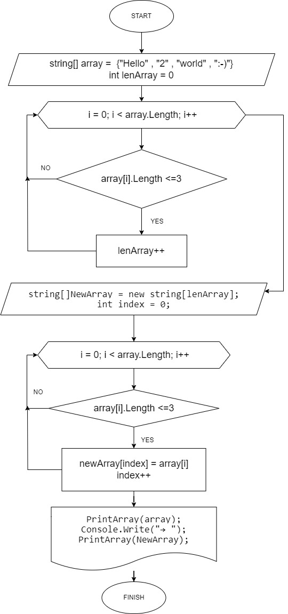

# ЗАДАНИЯ
1. Создать репозиторий на GitHub
2. Нарисовать блок-схему алгоритма (можно обойтись блок-схемой основной содержательной части, если вы выделяете её в отдельный метод)
3. Снабдить репозиторий оформленным текстовым описанием решения (файл README.md)
4. Написать программу, решающую поставленную задачу
5. Использовать контроль версий в работе над этим небольшим проектом (не должно быть так, что всё залито одним коммитом, как минимум этапы 2, 3, и 4 должны быть расположены в разных коммитах)
6. Решить задачу:
   > Написать программу, которая из имеющегося массива строк формирует новый массив из строк, длина которых меньше, либо равна 3 символам.
   > Первоначальный массив можно ввести с клавиатуры, либо задать на старте выполнения алгоритма. При решении не рекомендуется пользоваться коллекциями, лучше обойтись исключительно массивами.
   >> примеры
   >>  [“Hello”, “2”, “world”, “:-)”] → [“2”, “:-)”]

   >> [“1234”, “1567”, “-2”, “computer science”] → [“-2”]

   >> [“Russia”, “Denmark”, “Kazan”] → []

# РЕШЕНИЯ
1. Создание репозитория в GitHub.com (url репозитория). С добавлением «пустого» файла Readme.md.
2. Создание локального репозитория. В терминале VSCode командой git init был создан локальный репозиторий проекта.
3. Коммуникация (связывание) удаленного и локального репозиториев. Использованы команды git remote add origin <url>, git branch -M main, git push -u origin main
4. Заполнение файла README.md.
5. Cоздание блок-схемы решения задачи в drawio.



6. Создание проекта. В терминале VSCode командой dotnet new console был создан проект на C#. Для запуска проекта использована команда dotnet run.
7. Написание программного кода на C#.

```c#
string[] array = {"Hello" , "2" , "world" , ":-)"};

int lenArray = 0;

// считаем количество строк

for (int i = 0; i < array.Length; i++)

{

    if (array[i].Length <= 3)
    {
        lenArray++;
    }
    
}

// создаем новый массив нужного размера

string[]NewArray = new string[lenArray];

int index = 0;

// заполняем новый массив строками нужного размера

for (int i = 0; i < array.Length; i++)

{

    if (array[i].Length <= 3)
    {
        NewArray[index] = array[i];
        index++;
    }
}

// Console.WriteLine($"[{string.Join(", ", array)}] → [{string.Join(", ", NewArray)}]");

PrintArray(array);

Console.Write("→ ");

PrintArray(NewArray);


//  Функция вывода массива в терминал

void PrintArray(string[] array)

{

    Console.Write("[ ");
    for (int i = 0; i < array.Length; i++)
    {
        Console.Write($"“{array[i]}”, ");
    }
    Console.Write("] ");
}

```


8. После каждого шага выполнялась отправка промежуточных коммитов в удаленный репозиторий командами git add, git commit, git push.
